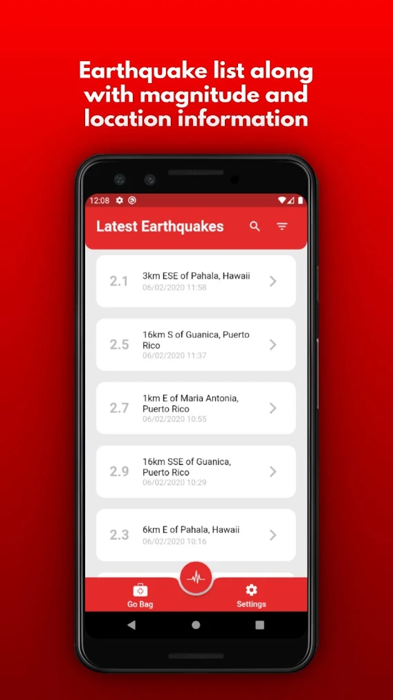
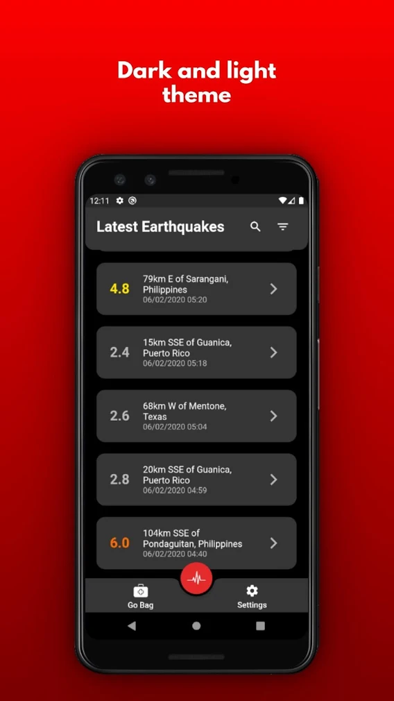
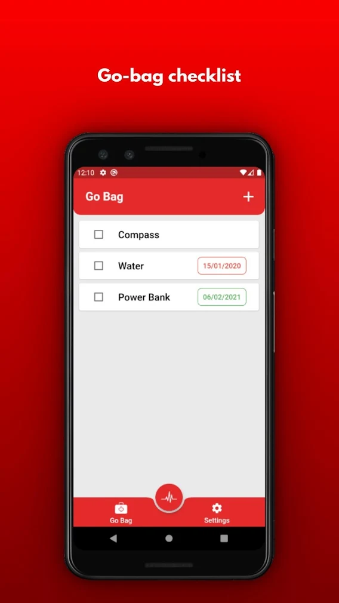
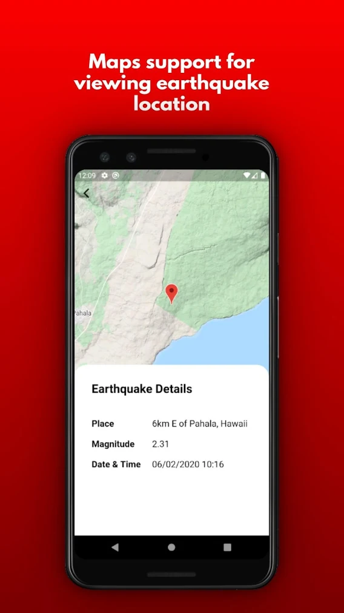

# Earthquakes And Go-Bag List

A Flutter appklication that shows the last earthquake events around the world. Made with Flutter and uses the USGS earthquake endpoint.

#  Features

  - Realtime earthquake events list
  - Show earthquake on the map
  - create personal go-bag list 

License
----

MIT

